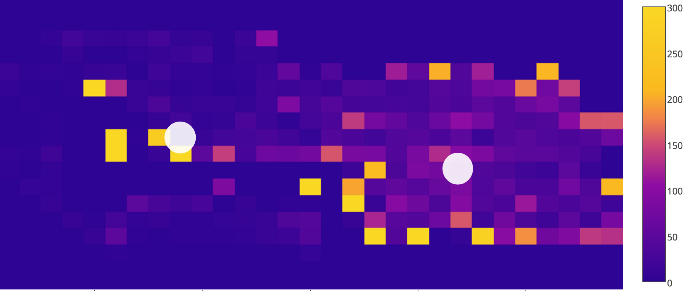
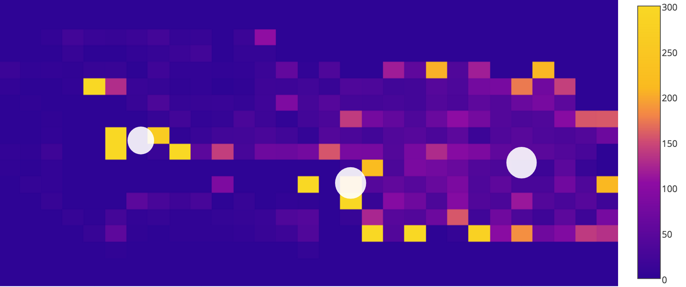
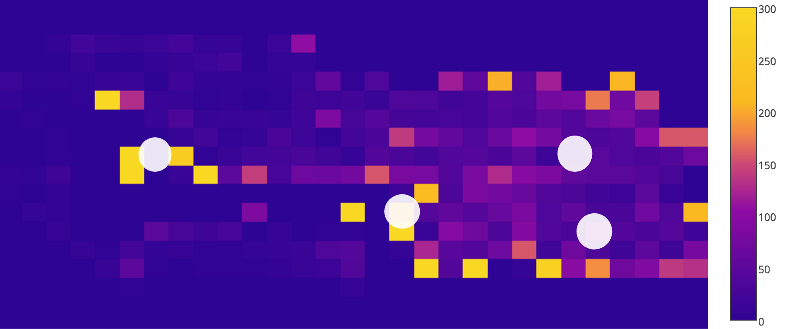

# Analysis-of-NPC-Pathfinding

# Introduction
While moving around, some NPCs in 2007scape will attack you. Sometimes this can be a unwanted encounter, but at other times you may want to NPCs to attack you if you're training a combat skill. NPCs that automatically attack you are called aggressive. Aggressive monsters will attack you once they have detected that you are n squares away from, where most monsters have n = 1. The map is laid out in a grid, of i x j cells.

# Analysis
Using this knowledge and the data of the frequency of monster presence per cell, can we determine the most optimal location such that the user maximizes the amount of time in combat with a certain type of monster?

For the first attempt, we have tracked all monster (Aberrant Spectre) movements in a closed location and have a dataset of 25,000 data points over 10 minutes. Firstly we aim to clean the data of incorrect data that may falsely influence our analysis.

Heatmap 1: All datapoints

To provide some context as to what is being seen, the monsters here are enclosed in a set of walls. 

However there are several rogue cells that have suspiciously high frequencies that are outside of the the area of interest. We wish to remove these from our analysis. Now that the grid is more balanced, we can set the max. value of the heatmap to 500 and 300.

Heatmap 2: Max. value of 500

Heatmap 3: Max. value of 300

k-means clustering with k = 2:

Centroids at 
[[ 43.2688305   62.31251932]
 [ 44.91405606  49.27699918]]

k-means clustering, k = 3: 

Centroids at 
[[ 43.80525666  65.02681249]
 [ 42.80493402  57.60508701]
 [ 45.28231757  47.54878382]]

k-means clustering, k = 4

Centroids at 
[[ 46.88892289  64.21603427]
 [ 45.33934338  47.6477395 ]
 [ 42.41322654  57.52002465]
 [ 40.5410503   65.40421598]]

In my opinion, the centroids do not really provide additional information for this problem. However we can see there are two distinct areas with a high concentration of monsters. 
